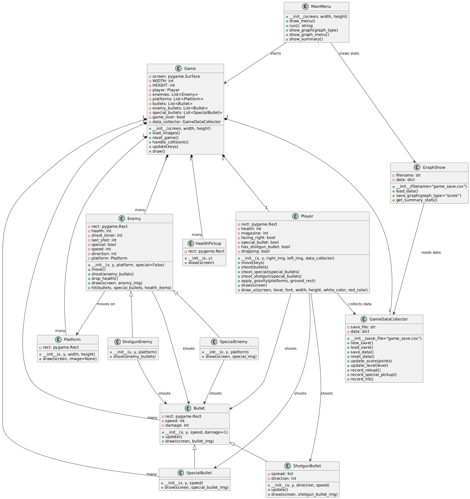

# comprog2_year_project
Sure! Here's the complete `README.md` written in proper Markdown format, including the new control information:

---

```markdown
# 🕹️ Game Project with Graph Stats

This is a simple game menu system built using `pygame` that allows players to:

- Start the game (placeholder or your custom gameplay)
- View gameplay statistics as graphs (Score, Level, Hits Taken)
- View a summary of gameplay stats (Average Points, Max Accuracy, etc.)

Gameplay data is loaded from a `game_save.csv` file and visualized using `matplotlib`.

---

```markdown
## 📦 Requirements

Before running the project, ensure you have Python and the required libraries installed.

### ✅ Python Version

- Python 3.7 or higher

### 📦 Install Required Packages

Install all dependencies using:

```bash
pip install -r requirements.txt

---

## 📁 Project Structure

```
.
├── main.py                  # Main launcher and menu system
├── model                   # Folder that contain model for this game
├── views                   # Folder contain files for create ui
├── control                 # control game flow
├── game_save.csv           # Game data file (must exist to view stats)
├── README.md               # Project documentation
```

---

## 🚀 How to Run

1. **Clone the repository**

```bash
git clone <https://github.com/peerawattae/comprog2_year_project.git>
cd <comprog2_year_project>
```

2. **Create or verify the `game_save.csv` file**

If it doesn’t already exist, create one manually with this content:

```csv
score,reloads,special_pickups,level,hits_taken
60,3,2,2,1
40,2,1,1,3
100,4,3,3,2
```

3. **Run the game**

```bash
python main.py
```

---

## 🎮 Controls

When inside the game (after clicking "Start Game"):

| Key | Action           |
|-----|------------------|
| W   | Walk Up          |
| A   | Walk Left        |
| S   | Walk Down        |
| D   | Walk Right       |
| J   | Normal Shoot     |
| space bar   | Jump     |


---

## 📊 Stats & Graphs

### From the Main Menu:

- **View Stats**  
  Opens a graph menu with options:
  - **Points**: Shows player score over time.
  - **Level**: Displays states/levels reached.
  - **Times Got Shot**: Shows how often the player got hit.

- **Stats Summary**  
  Shows a text summary of:
  - Average & Max Points
  - Average & Max Accuracy (%)
  - Average & Max Special Pickups

---

## 🛠️ Customize

- Update `graph_show.py` to add new types of graphs or statistics.
- Expand your gameplay in `main.py` or a separate gameplay file.
- Append new data rows to `game_save.csv` after each game session to track progress.

---

## 📌 Notes

- The game runs in fullscreen-sized 800x600 by default.
- Graphs are generated using `matplotlib` and rendered in `pygame` windows.
- Graphs are saved as `graph_image.png` before being displayed.

---
## 📐 UML Diagram

Below is the UML diagram for the project structure and interactions:



---
Enjoy the game and happy analyzing! 🎯
```
